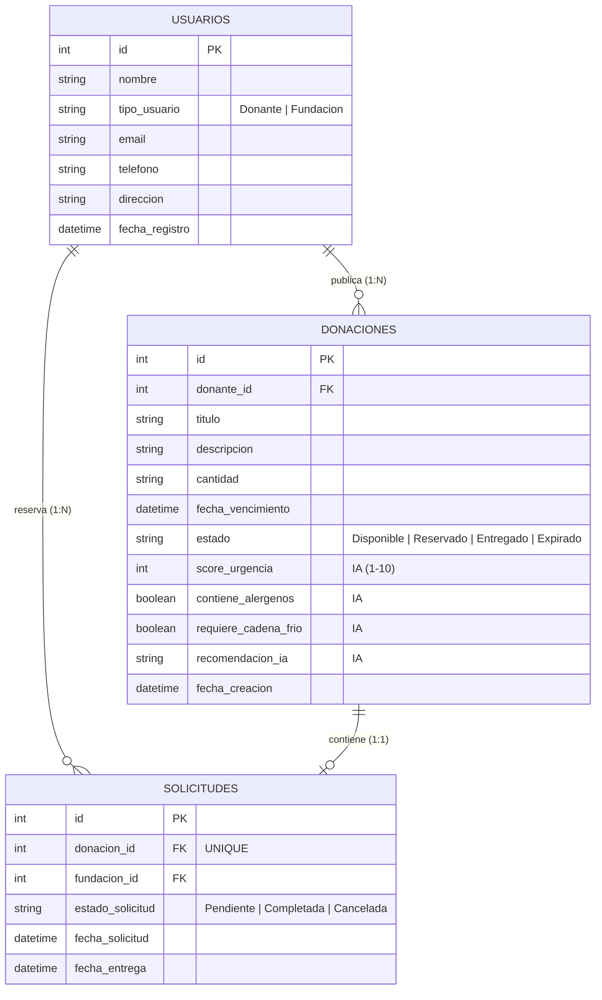

# Esquema de Base de Datos — FoodBridge API

> Responsable: Database Specialist (Fase 2: Base de Datos, tareas 2.0 - 2.2)

## 1. Diagrama Entidad-Relación



## 2. Entidades

### Usuario

| Campo | Tipo | Descripción |
|---|---|---|
| Id | int | Clave primaria autoincremental de la organización o actor social. |
| Nombre | string (VARCHAR 150) | Nombre comercial del donante (ej. "Restaurante El Gran Lomo") o entidad (ej. "Comedor San José"). |
| TipoUsuario | string (VARCHAR 20) | Rol dentro del sistema: 'Donante' o 'Fundacion'. |
| Email | string (VARCHAR 150) | Correo electrónico de contacto (Único). |
| Telefono | string (VARCHAR 20) | Número telefónico de contacto directo para coordinación logística. |
| Direccion | string (TEXT) | Dirección física para la recogida de alimentos o ubicación del centro de acopio. |
| FechaRegistro | DateTime | Timestamp de la creación de la cuenta en el sistema. |

### Donacion

| Campo | Tipo | Descripción |
|---|---|---|
| Id | int | Clave primaria autoincremental del lote de alimentos. |
| DonanteId | int (FK) | Clave foránea referenciando al usuario de tipo 'Donante' que publica. |
| Titulo | string (VARCHAR 150) | Breve resumen de la donación (ej. "15 raciones de sopa de verduras"). |
| Descripcion | string (TEXT) | Detalles adicionales ingresados por el donante (ingredientes, empaque, etc.). |
| Cantidad | string (VARCHAR 50) | Volumen o peso aproximado (ej. "10 kg", "20 porciones"). |
| FechaVencimiento | DateTime | Fecha y hora límite estimada para el consumo seguro del alimento. |
| Estado | string (VARCHAR 20) | Estado actual del lote: 'Disponible', 'Reservado', 'Entregado', 'Expirado'. |
| ScoreUrgencia | int | Evaluado por Google Gemini IA (1-10). Mayor prioridad para consumo rápido. |
| ContieneAlergenos | bool | Evaluado por Google Gemini IA. Indicador de alérgenos comunes detectados. |
| RequiereCadenaFrio | bool | Evaluado por Google Gemini IA. Define si el alimento necesita refrigeración. |
| RecomendacionIa | string (TEXT) | Evaluado por Google Gemini IA. Pautas breves para la conservación o transporte. |
| FechaCreacion | DateTime | Timestamp de publicación de la donación en la plataforma. |

### Solicitud

| Campo | Tipo | Descripción |
|---|---|---|
| Id | int | Clave primaria autoincremental del registro de reserva/recogida. |
| DonacionId | int (FK, UNIQUE) | Clave foránea referenciando a la donación apartada (Único / 1:1). |
| FundacionId | int (FK) | Clave foránea referenciando a la organización de tipo 'Fundacion' que recoge. |
| EstadoSolicitud | string (VARCHAR 20) | Estado de la gestión: 'Pendiente', 'Completada', 'Cancelada'. |
| FechaSolicitud | DateTime | Timestamp en el que la fundación apartó el lote en la API. |
| FechaEntrega | DateTime? | Timestamp en el que se confirma la entrega final del alimento (Nulable). |

## 3. Relaciones

- **Usuario (Donante) → Donacion (1:N)**: Un usuario registrado como donante puede publicar múltiples donaciones de alimentos a lo largo del tiempo, pero cada donación pertenece a un único donante.
- **Usuario (Fundación) → Solicitud (1:N)**: Una fundación o albergue para personas en situación de calle puede realizar múltiples solicitudes de recogida, pero cada solicitud es gestionada por una única fundación.
- **Donacion → Solicitud (1:1)**: Cada donación disponible solo puede vincularse a una única solicitud activa a la vez para evitar duplicidad de recogidas. La columna `DonacionId` en la tabla `Solicitudes` implementa una restricción de unicidad (UNIQUE).

## 4. Connection String (Supabase)

> No incluir credenciales reales aquí. Usar `appsettings.Development.json.example` como plantilla.

La cadena de conexión real **no** se guarda en ningún archivo del repositorio (ni siquiera en
`appsettings.Development.json`, que además está ignorado por Git). Se configura localmente con
`dotnet user-secrets`, que ASP.NET Core carga automáticamente en modo Development:

```
cd foodBridgeAPI
dotnet user-secrets init
dotnet user-secrets set "ConnectionStrings:SupabaseConnection" "Host=...;Port=5432;Database=postgres;Username=...;Password=...;SSL Mode=Require;Trust Server Certificate=true"
```

Cada integrante del equipo debe correr esto una vez en su máquina con la cadena de conexión real
(solicitarla al Database Specialist) para poder ejecutar el proyecto localmente.

## 5. Estado del esquema

El esquema de las 3 tablas (`Usuarios`, `Donaciones`, `Solicitudes`), sus relaciones y el índice
único de `Solicitudes.DonacionId` ya están creados y en uso en la instancia de Supabase del
proyecto, con datos de prueba (seed) cargados.

No existe una carpeta `Migrations/` de EF Core en este repositorio: el esquema se creó y gestiona
directamente sobre la base remota de Supabase, no por migraciones versionadas localmente. Esto
significa que:

- Todo el equipo apunta a la **misma** base de datos en la nube (no hay una base local por
  desarrollador que migrar).
- Si en el futuro se necesita modificar el esquema, debe hacerse coordinado entre el equipo
  (idealmente introduciendo migraciones EF Core a partir de este punto, para tener historial
  versionado de cambios).